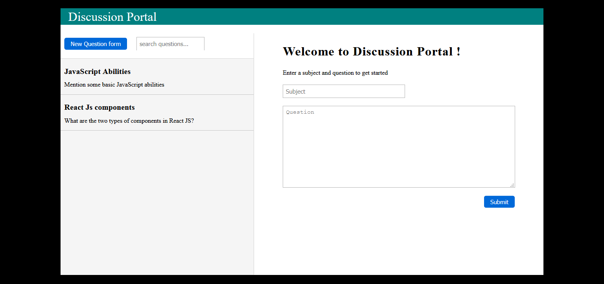
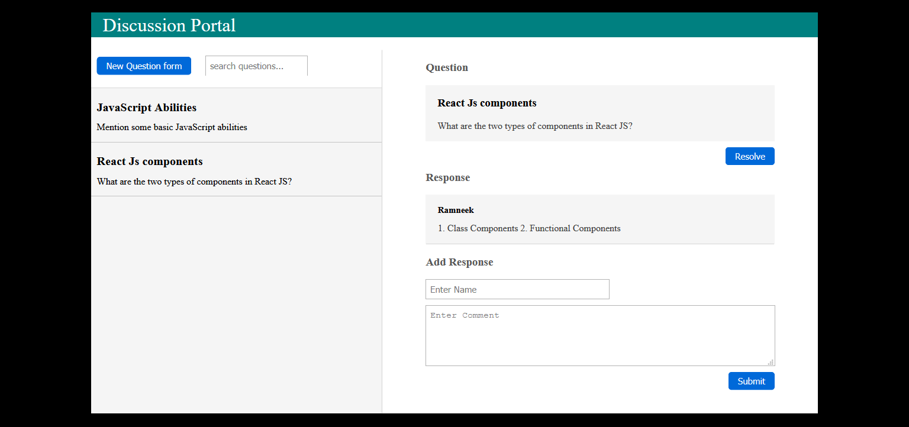

# Discussion-Portal

A simple portal for discussing any topic.

## Features: 
* Add any question you doubt about.
* Add responses to the questions listed.
* Filter questions according to the keywords.
* Resolve(delete) questions when satisfied with the responses or the topic is cleared.
* All data is stored in Local Storage.

## Screenshots

- <h4>Question Form</h4>

- <h4>Responses</h4>

